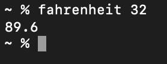

Run `go install` to add a binary you can call from terminal to parse the command-line arg (degrees celcius) into farenheit

After install, do `fahrenheit <calcius_temp_arg>` in your terminal, and it will poop out the fahrenheit temperature.

ex:
 
